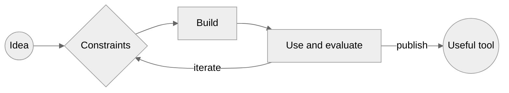
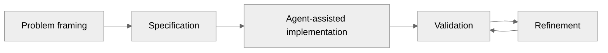

# Melbin J Paulose

### Building practical software around AI agents, retrieval, and browser-native systems

> I turn loosely defined ideas into scoped software projects by defining the problem, constraints, expected behaviour, and acceptance criteria—then directing AI-assisted implementation and iteration.

## Selected work

### [Rigout](https://github.com/melbinjp/rigout)

A released-beta Python package that lets authorized AI agents interact with a computer, VM, or container through MCP.

**Includes:** command and file operations, persistent terminals, Docker controls, system inspection, tunneled access, lifecycle management, authentication, and activity logging.

`Python` `MCP` `Starlette` `Cloudflare Tunnel` `pytest` `GitHub Actions`

---

### [CiteRAG](https://github.com/melbinjp/citerag)

A hackathon project evolved from [DocQA](https://github.com/melbinjp/DocQA), built for question answering over PDFs with retrievable page-level sources.

**Includes:** PDF extraction, targeted OCR, deterministic chunking, dense and sparse retrieval, Qdrant, streaming responses, and a React interface.

`Python` `FastAPI` `React` `Qdrant` `BGE-M3` `Docker`

---

### [Mango Modem](https://github.com/melbinjp/audio_data_transfer)

An experimental browser application that transfers files between devices through audible sound.

**Includes:** 4-FSK modulation, binary framing, CRC32 validation, acknowledgements, retries, microphone reception, and file reassembly.

`TypeScript` `Web Audio API` `AudioWorklet` `Vite` `Vitest`

---

### [Jules Prompts](https://github.com/melbinjp/jules-prompts)

A machine-readable prompt library for turning broad development requests into scoped, verifiable tasks for coding agents.

**Covers:** repository audits, project hardening, implementation workflows, dependency maintenance, UI review, and repository curation.

`Markdown` `YAML` `JSON` `Jekyll` `GitHub Pages`

## How I work

I use AI coding agents heavily. My contribution is primarily in problem selection, specification, constraints, evaluation, iteration, and deciding what should be improved, published, or stopped.

## More work

[Audio Editor](https://github.com/melbinjp/audio-editor) ·
[Make a Call](https://github.com/melbinjp/make-a-call) ·
[DocQA API](https://github.com/melbinjp/DocQA_api)

---

Open to junior roles and bounded project work involving **AI tooling, automation, retrieval systems, and technical workflows**.

